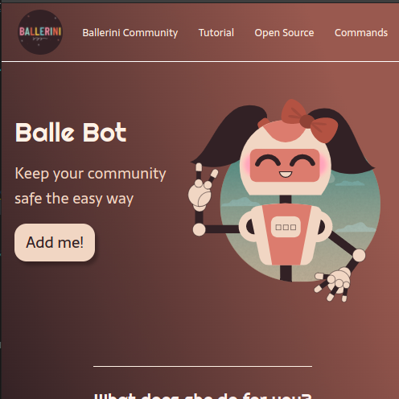
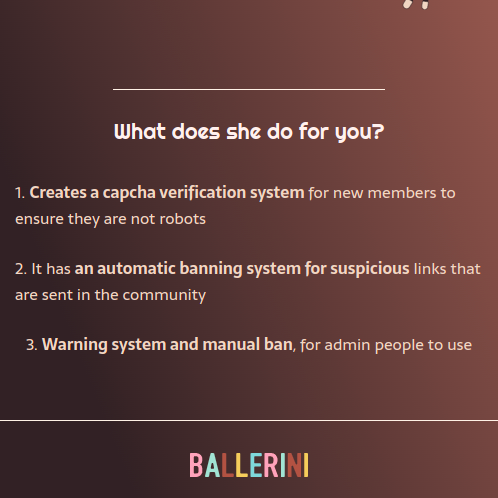
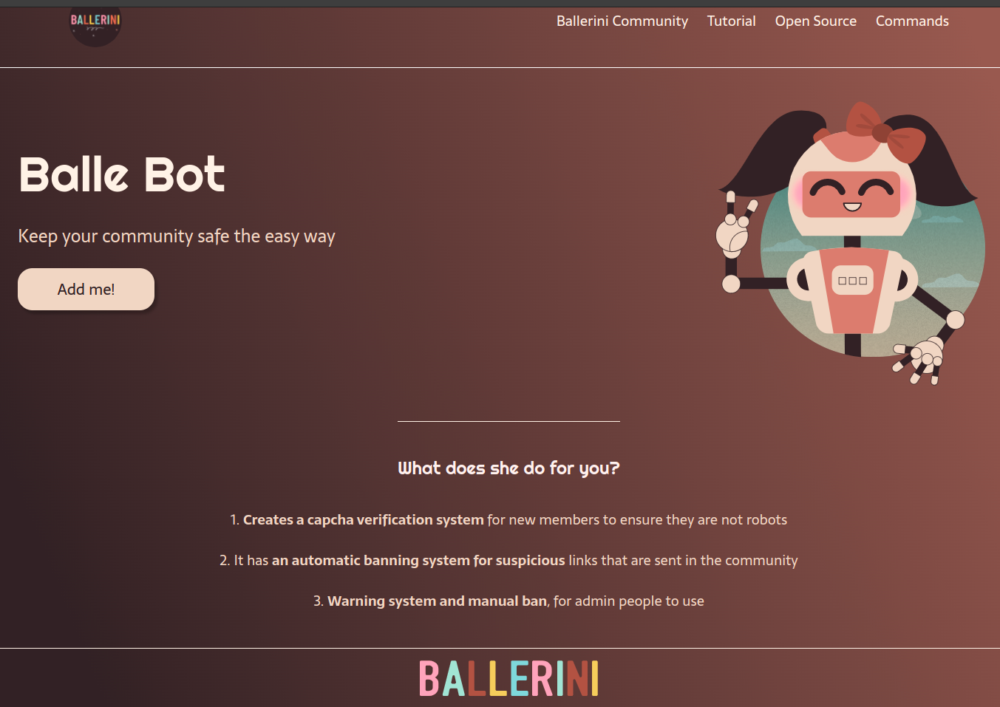

# Balle-Bot
Studying flex box with a simple Rafaela Ballerine landing page!

Imagens da landing page:

Flex Box Guide (site): https://css-tricks.com/snippets/css/a-guide-to-flexbox/

Youtube video link : https://www.youtube.com/watch?v=llF6vD-RljE

Github Repositorie : https://github.com/rafaballerini/LandingPage

## Obrigada pela visita >_<

 
  
   
   
